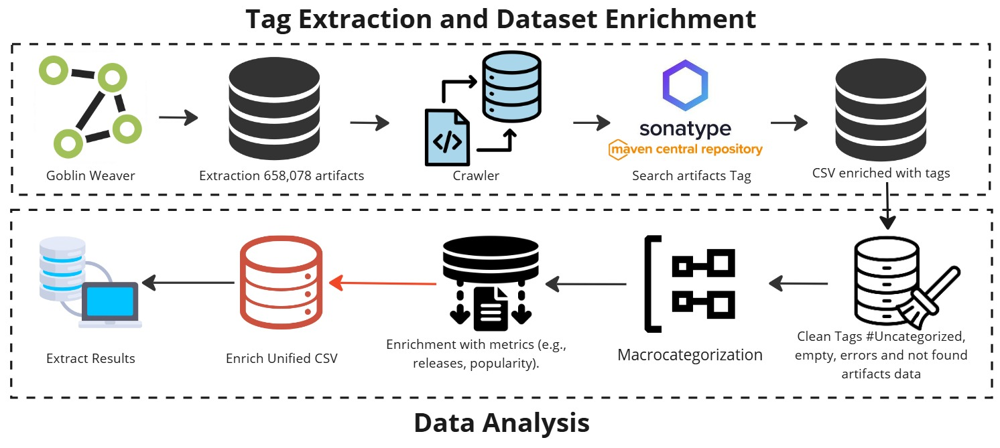
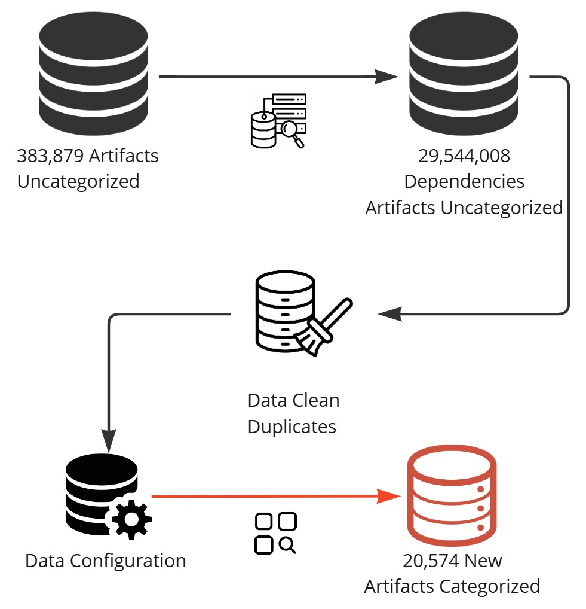

Mining Challenge

## The Evolution of the Maven Ecosystem: Strategies for Dependency Enrichment and Categorization with Automation

### Overview and Goal

This study investigates the categorization of dependencies in Maven Central. The goal is to explore how semantic tags can enrich artifact metadata, identify differences between categorized and uncategorized dependencies, and evaluate automated approaches for systematic organization. The contributions include a qualitative and quantitative analysis of tags, macro-categorization of artifacts, and insights into dependency classification challenges and opportunities.

### Research Questions

The research is guided by the following questions:

1. **RQ1: What do the tags reveal?**
   - Semantic and qualitative-quantitative analysis.
   - Exploration of macro-categories and multi-categorized artifacts.
   - Examination of which categories frequently co-occur.

2. **RQ2: What is the difference between categorized and uncategorized dependencies?**
   - Identification of significant differences (or lack thereof) between these groups.

3. **RQ3: Is it possible to automate the categorization process?**
   - Use of sampling techniques and dependency intersection analysis.
   - Evaluation of category quality and feasibility of automation.

### Methodology

#### Data Collection Workflow

1. **Artifact Extraction**:
   - The Goblin Framework (a) was used to extract dependency data, resulting in over 658,078 artifacts from Maven Central.

2. **Provisioning Environment**:
   - A cloud environment (b) was provisioned on Oracle Cloud to process and store extracted data in a structured CSV format (d).

3. **Data Enrichment**:
   - Tags for artifacts were retrieved using automated Python/Selenium scripts (c), querying the Maven Central repository (e).
   - CSV files were enriched with tag information (f).

#### Data Analysis Workflow

1. **Cleaning Tags**:
   - Data cleaning processes (d) removed tags such as `#Uncategorized`, empty entries, and artifacts with incomplete metadata.

2. **Enriching Metrics**:
   - Metrics including freshness, security, and performance were extracted (c) to enhance the dataset.

3. **Macro-Categorization**:
   - Cleaned and enriched data (e) was systematically grouped into macro-categories (f) for further analysis.

### Figures

#### Data Collection and Data Analysis Workflow

#### Methodology RQ3 Workflow

#### Conclusion

This study demonstrates the importance of structured approaches to dependency categorization in large ecosystems like Maven Central. By combining semantic analysis, automation, and systematic cleaning, it is possible to derive actionable insights and improve dependency management practices for developers and researchers.

#### References

**[1]** D. Jaime, J. El Haddad, and P. Poizat, "Navigating and Exploring Software Dependency Graphs using Goblin," in *Proc. Int. Conf. Mining Softw. Repositories (MSR)*, 2025.
